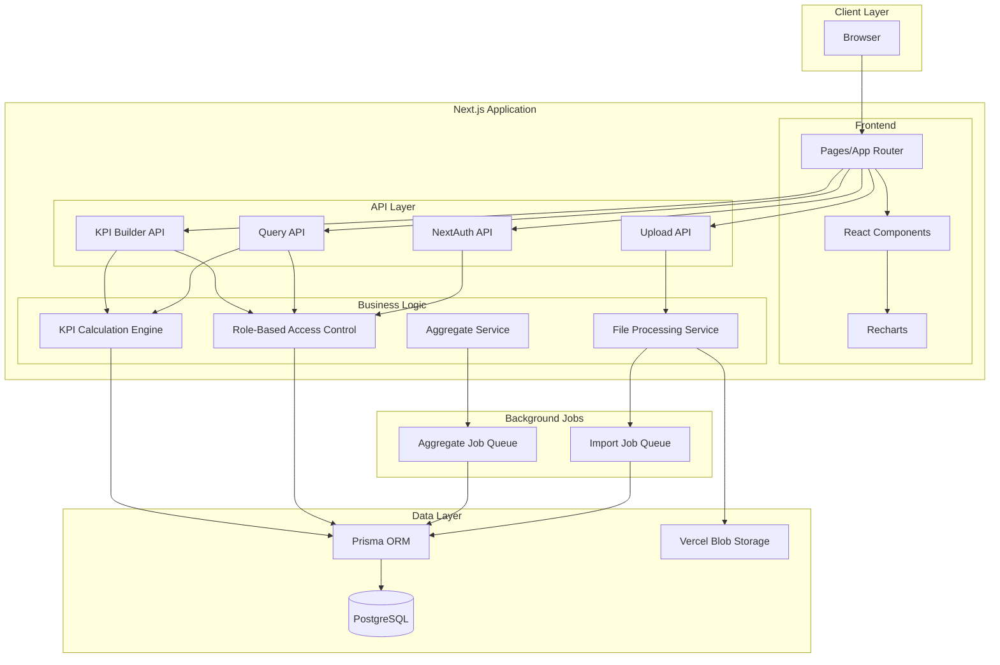
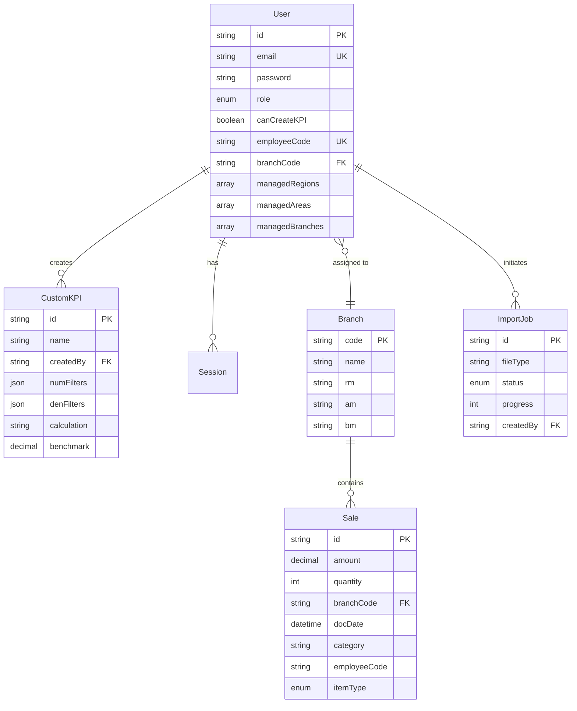
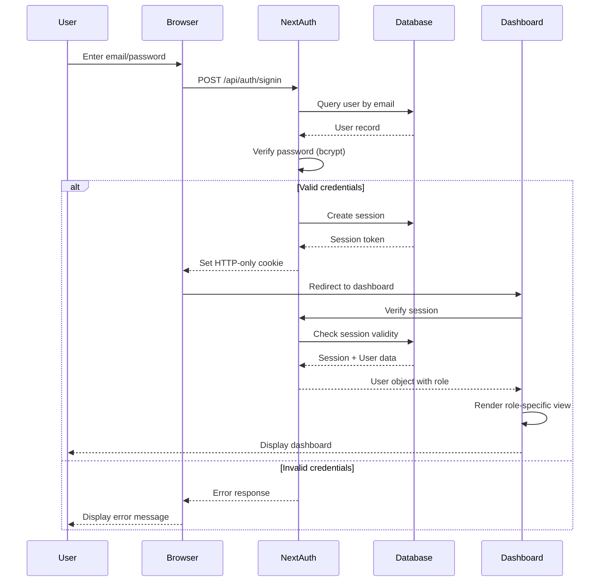
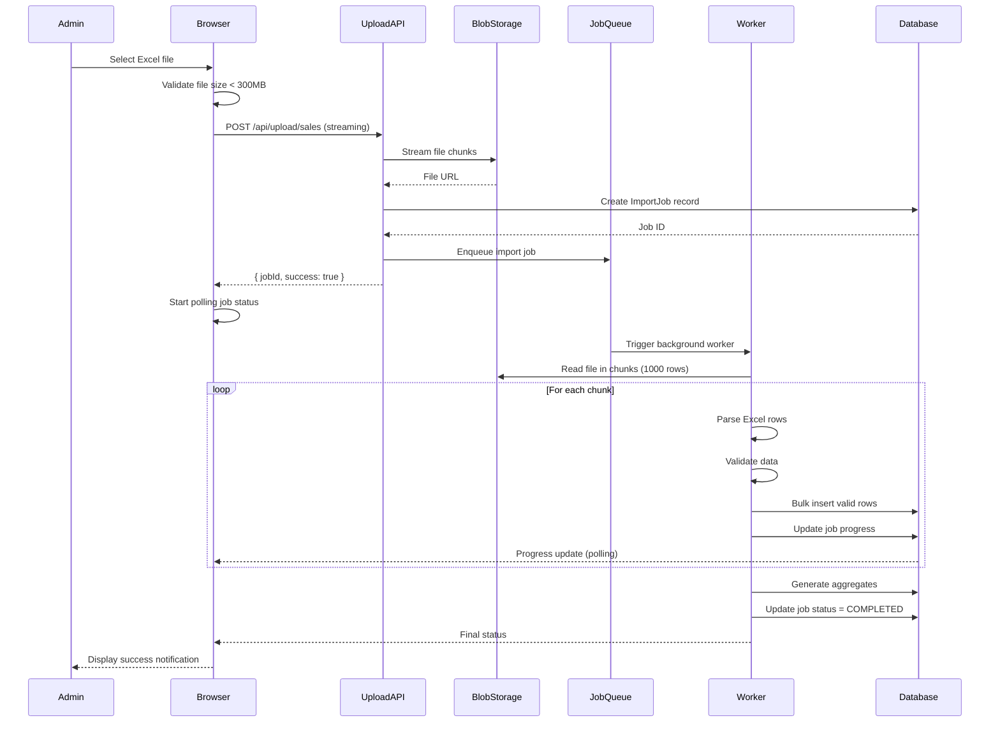
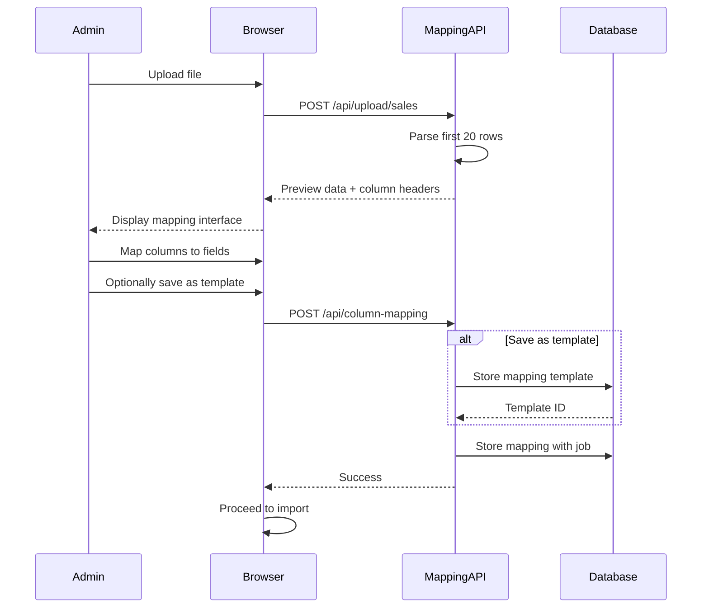
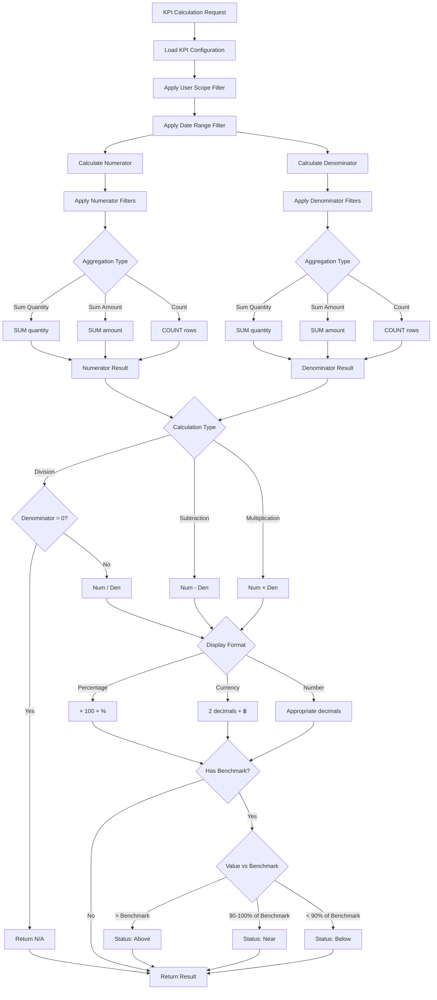

# Design Document: Sales Dashboard System

## Overview

Sales Dashboard System เป็น web application สำหรับติดตามและวิเคราะห์ยอดขายขององค์กร โดยรองรับการนำเข้าข้อมูลจากไฟล์ Excel ขนาดใหญ่ (10-300 MB) และแสดงผลข้อมูลตาม role-based access control ที่เข้มงวด

### Core Capabilities

- **Multi-Role Dashboard**: รองรับ 5 roles (Admin, RM, AM, BM, Staff) โดยแต่ละ role เห็นข้อมูลเฉพาะที่มีสิทธิ์เข้าถึง
- **Large File Processing**: ประมวลผลไฟล์ Excel ขนาด 10-300 MB (50K-500K rows) ด้วย streaming และ background jobs
- **Custom KPI Builder**: ให้ผู้ใช้ที่ได้รับสิทธิ์สร้าง KPI แบบ dynamic ด้วย filters และ calculations ที่กำหนดเอง
- **Flexible Column Mapping**: รองรับการ map columns จากไฟล์ Excel ที่มี structure แตกต่างกัน พร้อม template system
- **Performance Optimization**: ใช้ aggregate tables, caching, และ indexing เพื่อรองรับ 80 concurrent users

### Technology Stack

**Frontend:**
- Next.js 14 (App Router) - React framework with server components
- TypeScript - Type safety
- Tailwind CSS - Utility-first styling
- shadcn/ui - Component library
- Recharts - Chart visualization

**Backend:**
- Next.js API Routes - Serverless API endpoints
- Prisma ORM - Type-safe database client
- NextAuth.js - Authentication

**Database:**
- PostgreSQL (Vercel Postgres) - Relational database

**Infrastructure:**
- Vercel - Deployment platform
- Vercel Blob Storage - File storage for uploads

## Architecture

### System Architecture Diagram



### Architecture Patterns

**1. Server-Side Rendering (SSR) with Next.js App Router**
- ใช้ Server Components สำหรับ initial page load เพื่อ SEO และ performance
- ใช้ Client Components สำหรับ interactive features (charts, filters)
- API Routes ทำหน้าที่เป็น backend endpoints

**2. Role-Based Access Control (RBAC)**
- Middleware layer ตรวจสอบ role และ scope ก่อนทุก API call
- Database queries มี WHERE clauses ที่ filter ตาม user scope อัตโนมัติ
- Frontend components render ตาม role permissions

**3. Streaming File Upload**
- ใช้ multipart/form-data streaming เพื่อไม่ให้ load ทั้งไฟล์เข้า memory
- เก็บไฟล์ใน Vercel Blob Storage ก่อน process
- Background job อ่านไฟล์เป็น chunks และ insert เข้า database

**4. Aggregate Pattern**
- Pre-calculate summaries (daily, monthly, yearly) และเก็บใน aggregate tables
- Query จาก aggregate tables เมื่อ date range > 90 days
- Background job update aggregates หลัง import เสร็จ

**5. Caching Strategy**
- Cache frequently accessed data (branch list, user list) ใน memory 5 minutes
- Use Next.js built-in caching for static data
- Invalidate cache เมื่อมีการ import ข้อมูลใหม่

## Components and Interfaces

### Frontend Component Structure

```
app/
├── (auth)/
│   ├── login/
│   │   └── page.tsx                 # Login page
│   └── layout.tsx                   # Auth layout
├── (dashboard)/
│   ├── layout.tsx                   # Dashboard layout with nav
│   ├── page.tsx                     # Role-based dashboard router
│   ├── admin/
│   │   ├── users/
│   │   │   └── page.tsx            # User management
│   │   ├── upload/
│   │   │   └── page.tsx            # File upload & column mapping
│   │   └── jobs/
│   │       └── page.tsx            # Background job status
│   ├── rm/
│   │   └── page.tsx                # RM dashboard
│   ├── am/
│   │   └── page.tsx                # AM dashboard
│   ├── bm/
│   │   └── page.tsx                # BM dashboard
│   ├── staff/
│   │   └── page.tsx                # Staff dashboard
│   └── kpi-builder/
│       └── page.tsx                # Custom KPI builder
├── api/
│   ├── auth/
│   │   └── [...nextauth]/
│   │       └── route.ts            # NextAuth configuration
│   ├── users/
│   │   └── route.ts                # User CRUD operations
│   ├── upload/
│   │   ├── sales/
│   │   │   └── route.ts            # Sales file upload
│   │   └── branches/
│   │       └── route.ts            # Branch file upload
│   ├── column-mapping/
│   │   └── route.ts                # Save/load column mappings
│   ├── sales/
│   │   └── route.ts                # Query sales data
│   ├── kpi/
│   │   ├── route.ts                # CRUD custom KPIs
│   │   └── calculate/
│   │       └── route.ts            # Calculate KPI values
│   ├── export/
│   │   └── route.ts                # Export data to Excel/CSV
│   └── jobs/
│       └── [id]/
│           └── route.ts            # Job status polling
└── components/
    ├── ui/                          # shadcn/ui components
    ├── charts/
    │   ├── KPICard.tsx             # KPI metric card
    │   ├── TrendChart.tsx          # Line chart for trends
    │   ├── BarChart.tsx            # Bar chart for comparisons
    │   └── PieChart.tsx            # Pie/donut chart
    ├── tables/
    │   ├── DataTable.tsx           # Sortable data table
    │   └── Pagination.tsx          # Pagination controls
    ├── filters/
    │   ├── DateRangePicker.tsx     # Date range selector
    │   ├── MultiSelect.tsx         # Multi-select filter
    │   └── FilterPanel.tsx         # Combined filter panel
    ├── upload/
    │   ├── FileUploader.tsx        # Drag-drop file upload
    │   ├── ColumnMapper.tsx        # Column mapping interface
    │   └── ProgressBar.tsx         # Upload progress
    └── kpi/
        ├── KPIBuilder.tsx          # KPI configuration form
        └── KPIDisplay.tsx          # KPI value display
```

### Key Component Interfaces

**KPICard Component**
```typescript
interface KPICardProps {
  title: string;
  value: number | string;
  format: 'percentage' | 'currency' | 'number';
  benchmark?: number;
  trend?: {
    direction: 'up' | 'down';
    percentage: number;
  };
  loading?: boolean;
}
```

**DataTable Component**
```typescript
interface DataTableProps<T> {
  columns: ColumnDef<T>[];
  data: T[];
  sortable?: boolean;
  pagination?: {
    pageSize: number;
    currentPage: number;
    totalPages: number;
    onPageChange: (page: number) => void;
  };
}
```

**FilterPanel Component**
```typescript
interface FilterPanelProps {
  dateRange: { start: Date; end: Date };
  onDateRangeChange: (range: { start: Date; end: Date }) => void;
  categories?: string[];
  selectedCategories?: string[];
  onCategoriesChange?: (categories: string[]) => void;
  branches?: Branch[];
  selectedBranches?: string[];
  onBranchesChange?: (branches: string[]) => void;
  inventoryType?: 'all' | 'inventory' | 'non-inventory';
  onInventoryTypeChange?: (type: string) => void;
}
```

### API Endpoint Interfaces

**POST /api/upload/sales**
```typescript
Request: FormData {
  file: File;
  mappingTemplateId?: string;
}

Response: {
  success: boolean;
  jobId: string;
  message: string;
}
```

**POST /api/column-mapping**
```typescript
Request: {
  fileType: 'sales' | 'branches';
  mapping: {
    amount: string;      // Excel column letter
    quantity: string;
    branchCode: string;
    docDate: string;
    // ... other fields
  };
  saveAsTemplate?: boolean;
  templateName?: string;
}

Response: {
  success: boolean;
  templateId?: string;
}
```

**GET /api/sales**
```typescript
Query Parameters: {
  startDate: string;     // ISO date
  endDate: string;
  aggregation?: 'daily' | 'monthly' | 'yearly';
  branchCodes?: string[];
  employeeCodes?: string[];
  categories?: string[];
  inventoryType?: 'all' | 'inventory' | 'non-inventory';
}

Response: {
  data: SalesRecord[];
  summary: {
    totalAmount: number;
    totalQuantity: number;
    recordCount: number;
  };
}
```

**POST /api/kpi**
```typescript
Request: {
  name: string;
  numerator: {
    filters: {
      categories?: string[];
      subCategories?: string[];
      brands?: string[];
      models?: string[];
    };
    aggregation: 'sum_quantity' | 'sum_amount' | 'count';
  };
  denominator: {
    filters: {
      categories?: string[];
      subCategories?: string[];
      brands?: string[];
      models?: string[];
    };
    aggregation: 'sum_quantity' | 'sum_amount' | 'count';
  };
  calculation: 'division' | 'subtraction' | 'multiplication';
  displayFormat: 'percentage' | 'currency' | 'number';
  benchmark?: number;
  visibleToRoles: ('admin' | 'rm' | 'am' | 'bm' | 'staff')[];
}

Response: {
  success: boolean;
  kpiId: string;
}
```

**GET /api/kpi/calculate**
```typescript
Query Parameters: {
  kpiId: string;
  startDate: string;
  endDate: string;
  groupBy?: 'am' | 'branch' | 'employee';
  branchCodes?: string[];
  employeeCodes?: string[];
}

Response: {
  results: Array<{
    groupKey: string;      // AM name, branch code, or employee code
    groupLabel: string;    // Display name
    value: number;
    formattedValue: string;
    benchmark?: number;
    status?: 'above' | 'near' | 'below';
  }>;
}
```

## Data Models

### Database Schema (Prisma)

```prisma
// User and Authentication
model User {
  id                String    @id @default(cuid())
  email             String    @unique
  password          String    // bcrypt hashed
  role              Role
  canCreateKPI      Boolean   @default(false)
  createdAt         DateTime  @default(now())
  updatedAt         DateTime  @updatedAt
  
  // Role-specific fields
  employeeCode      String?   @unique
  branchCode        String?
  branch            Branch?   @relation(fields: [branchCode], references: [code])
  
  // For RM/AM
  managedRegions    String[]  // Array of region names
  managedAreas      String[]  // Array of area names
  managedBranches   String[]  // Array of branch codes
  managedAMs        String[]  // Array of AM user IDs
  
  customKPIs        CustomKPI[]
  sessions          Session[]
  
  @@index([email])
  @@index([employeeCode])
  @@index([branchCode])
}

enum Role {
  ADMIN
  RM
  AM
  BM
  STAFF
}

model Session {
  id           String   @id @default(cuid())
  sessionToken String   @unique
  userId       String
  expires      DateTime
  user         User     @relation(fields: [userId], references: [id], onDelete: Cascade)
  
  @@index([userId])
}

// Branch Data
model Branch {
  code          String   @id
  name          String
  unit          String
  rm            String
  am            String
  salesChannel  String
  bm            String
  contactNumber String?
  createdAt     DateTime @default(now())
  updatedAt     DateTime @updatedAt
  
  users         User[]
  sales         Sale[]
  
  @@index([rm])
  @@index([am])
  @@index([bm])
}

// Sales Transaction Data
model Sale {
  id              String   @id @default(cuid())
  amount          Decimal  @db.Decimal(12, 2)
  quantity        Int
  branchCode      String
  branch          Branch   @relation(fields: [branchCode], references: [code])
  docDate         DateTime
  category        String
  subCategory     String
  brand           String
  model           String
  employeeCode    String
  employeeName    String
  itemType        ItemType
  createdAt       DateTime @default(now())
  
  @@index([branchCode])
  @@index([employeeCode])
  @@index([docDate])
  @@index([category])
  @@index([brand])
  @@index([itemType])
  @@index([docDate, branchCode])
  @@index([docDate, employeeCode])
}

enum ItemType {
  INVENTORY
  NON_INVENTORY
}

// Aggregate Tables for Performance
model DailySalesAggregate {
  id            String   @id @default(cuid())
  date          DateTime
  branchCode    String
  employeeCode  String
  category      String
  totalAmount   Decimal  @db.Decimal(12, 2)
  totalQuantity Int
  transCount    Int
  createdAt     DateTime @default(now())
  
  @@unique([date, branchCode, employeeCode, category])
  @@index([date])
  @@index([branchCode])
  @@index([employeeCode])
}

model MonthlySalesAggregate {
  id            String   @id @default(cuid())
  year          Int
  month         Int
  branchCode    String
  employeeCode  String
  category      String
  totalAmount   Decimal  @db.Decimal(12, 2)
  totalQuantity Int
  transCount    Int
  createdAt     DateTime @default(now())
  
  @@unique([year, month, branchCode, employeeCode, category])
  @@index([year, month])
  @@index([branchCode])
  @@index([employeeCode])
}

model YearlySalesAggregate {
  id            String   @id @default(cuid())
  year          Int
  branchCode    String
  employeeCode  String
  category      String
  totalAmount   Decimal  @db.Decimal(12, 2)
  totalQuantity Int
  transCount    Int
  createdAt     DateTime @default(now())
  
  @@unique([year, branchCode, employeeCode, category])
  @@index([year])
  @@index([branchCode])
  @@index([employeeCode])
}

// Custom KPI Configuration
model CustomKPI {
  id                String   @id @default(cuid())
  name              String
  createdBy         String
  creator           User     @relation(fields: [createdBy], references: [id])
  
  // Numerator configuration
  numFilters        Json     // { categories?: string[], subCategories?: string[], brands?: string[], models?: string[] }
  numAggregation    String   // 'sum_quantity' | 'sum_amount' | 'count'
  
  // Denominator configuration
  denFilters        Json
  denAggregation    String
  
  calculation       String   // 'division' | 'subtraction' | 'multiplication'
  displayFormat     String   // 'percentage' | 'currency' | 'number'
  benchmark         Decimal? @db.Decimal(12, 2)
  
  visibleToRoles    Role[]
  
  createdAt         DateTime @default(now())
  updatedAt         DateTime @updatedAt
  
  @@index([createdBy])
}

// Column Mapping Templates
model ColumnMapping {
  id            String   @id @default(cuid())
  name          String
  fileType      String   // 'sales' | 'branches'
  mapping       Json     // { amount: 'E', quantity: 'C', ... }
  createdBy     String
  createdAt     DateTime @default(now())
  
  @@index([fileType])
  @@index([createdBy])
}

// Background Job Tracking
model ImportJob {
  id              String   @id @default(cuid())
  fileType        String   // 'sales' | 'branches'
  fileName        String
  fileSize        Int
  filePath        String   // Blob storage path
  status          JobStatus
  progress        Int      @default(0)
  totalRows       Int?
  processedRows   Int      @default(0)
  successRows     Int      @default(0)
  errorRows       Int      @default(0)
  errorLog        String?  @db.Text
  startedAt       DateTime @default(now())
  completedAt     DateTime?
  createdBy       String
  
  @@index([status])
  @@index([createdBy])
}

enum JobStatus {
  PENDING
  PROCESSING
  COMPLETED
  FAILED
}
```

### Data Relationships




### Authentication Flow



**Session Management:**
- Sessions stored in database with 24-hour expiry
- HTTP-only cookies prevent XSS attacks
- Session extended on each user action
- Automatic redirect to login on expiry

### File Upload & Processing Flow



**Processing Strategy:**
- Streaming upload prevents memory overflow
- File stored in Blob Storage before processing
- Background worker processes in 1000-row chunks
- Progress updates every 5 seconds via polling
- Failed rows logged but don't stop processing
- Aggregates generated after successful import

### Column Mapping Flow



**Mapping Features:**
- Preview first 20 rows for verification
- Dropdown selectors for each required field
- Save mappings as reusable templates
- Auto-apply templates for recurring uploads
- Validation ensures all required fields mapped

### KPI Calculation Engine



**Calculation Process:**
1. Load KPI configuration from database
2. Apply user's role-based scope filter
3. Apply date range and other filters
4. Execute numerator query with filters and aggregation
5. Execute denominator query with filters and aggregation
6. Perform calculation (division/subtraction/multiplication)
7. Handle edge cases (division by zero)
8. Format result according to display format
9. Compare with benchmark if configured
10. Return result with status indicator

### Role-Based Access Control Implementation

**Middleware Layer:**
```typescript
// lib/rbac.ts
export async function getUserScope(userId: string) {
  const user = await prisma.user.findUnique({
    where: { id: userId },
    include: { branch: true }
  });
  
  switch (user.role) {
    case 'ADMIN':
      return { type: 'all' };
    
    case 'RM':
      return {
        type: 'rm',
        regions: user.managedRegions,
        ams: user.managedAMs,
        branches: user.managedBranches
      };
    
    case 'AM':
      return {
        type: 'am',
        areas: user.managedAreas,
        branches: user.managedBranches
      };
    
    case 'BM':
      return {
        type: 'bm',
        branchCode: user.branchCode
      };
    
    case 'STAFF':
      return {
        type: 'staff',
        employeeCode: user.employeeCode
      };
  }
}

export function applyScopeToQuery(baseQuery: any, scope: any) {
  if (scope.type === 'all') return baseQuery;
  
  if (scope.type === 'rm') {
    return {
      ...baseQuery,
      branchCode: { in: scope.branches }
    };
  }
  
  if (scope.type === 'am') {
    return {
      ...baseQuery,
      branchCode: { in: scope.branches }
    };
  }
  
  if (scope.type === 'bm') {
    return {
      ...baseQuery,
      branchCode: scope.branchCode
    };
  }
  
  if (scope.type === 'staff') {
    return {
      ...baseQuery,
      employeeCode: scope.employeeCode
    };
  }
}
```

**Query Example:**
```typescript
// API route with RBAC
export async function GET(request: Request) {
  const session = await getServerSession(authOptions);
  const scope = await getUserScope(session.user.id);
  
  const { startDate, endDate, categories } = parseQueryParams(request);
  
  let query = {
    docDate: {
      gte: startDate,
      lte: endDate
    }
  };
  
  if (categories?.length) {
    query.category = { in: categories };
  }
  
  // Apply scope filter
  query = applyScopeToQuery(query, scope);
  
  const sales = await prisma.sale.findMany({
    where: query
  });
  
  return Response.json({ data: sales });
}
```

### Performance Optimization Strategy

**1. Database Indexing**
```sql
-- Critical indexes for query performance
CREATE INDEX idx_sale_docdate ON Sale(docDate);
CREATE INDEX idx_sale_branch ON Sale(branchCode);
CREATE INDEX idx_sale_employee ON Sale(employeeCode);
CREATE INDEX idx_sale_category ON Sale(category);
CREATE INDEX idx_sale_composite ON Sale(docDate, branchCode);
CREATE INDEX idx_sale_employee_date ON Sale(docDate, employeeCode);
```

**2. Aggregate Tables**
- Pre-calculate daily, monthly, yearly summaries
- Use aggregates for queries > 90 days
- Update aggregates in background after imports
- Reduces query time from seconds to milliseconds

**3. Query Optimization**
```typescript
// Use aggregates for long date ranges
function shouldUseAggregate(startDate: Date, endDate: Date): boolean {
  const daysDiff = (endDate.getTime() - startDate.getTime()) / (1000 * 60 * 60 * 24);
  return daysDiff > 90;
}

async function querySales(filters: any) {
  if (shouldUseAggregate(filters.startDate, filters.endDate)) {
    // Query from monthly/yearly aggregates
    return queryFromAggregates(filters);
  } else {
    // Query from main sales table
    return queryFromSales(filters);
  }
}
```

**4. Caching Strategy**
```typescript
// In-memory cache for frequently accessed data
const cache = new Map<string, { data: any, expiry: number }>();

function getCached<T>(key: string): T | null {
  const cached = cache.get(key);
  if (cached && cached.expiry > Date.now()) {
    return cached.data;
  }
  cache.delete(key);
  return null;
}

function setCache(key: string, data: any, ttlSeconds: number = 300) {
  cache.set(key, {
    data,
    expiry: Date.now() + (ttlSeconds * 1000)
  });
}

// Usage
async function getBranches() {
  const cached = getCached<Branch[]>('branches');
  if (cached) return cached;
  
  const branches = await prisma.branch.findMany();
  setCache('branches', branches, 300); // 5 minutes
  return branches;
}
```

**5. Connection Pooling**
```typescript
// Prisma configuration
datasource db {
  provider = "postgresql"
  url      = env("DATABASE_URL")
  connectionLimit = 20
}
```

**6. Pagination**
- Limit queries to 50 rows per page
- Use cursor-based pagination for large datasets
- Load additional pages on demand

**7. Streaming Responses**
- Stream large exports instead of loading all data
- Use server-sent events for real-time job progress
- Implement lazy loading for charts and tables


## Correctness Properties

*A property is a characteristic or behavior that should hold true across all valid executions of a system—essentially, a formal statement about what the system should do. Properties serve as the bridge between human-readable specifications and machine-verifiable correctness guarantees.*

### Property 1: Authentication with valid credentials grants access

*For any* valid email and password combination, when a user submits these credentials, the system should authenticate the user and grant access to the dashboard.

**Validates: Requirements 1.1**

### Property 2: Authentication with invalid credentials returns error

*For any* invalid email or password, when a user submits these credentials, the system should reject authentication and display an error message.

**Validates: Requirements 1.2**

### Property 3: Password encryption uses bcrypt with sufficient rounds

*For any* password, when the system encrypts it, the resulting hash should be verifiable as bcrypt with at least 10 salt rounds.

**Validates: Requirements 1.4**

### Property 4: Session expiry requires re-authentication

*For any* user session, when 24 hours have elapsed since the last activity, the system should require re-authentication before allowing access.

**Validates: Requirements 1.3**

### Property 5: User creation requires all mandatory fields

*For any* user creation attempt, if any required field (email, password, role, access scope) is missing, the system should reject the creation and return a validation error.

**Validates: Requirements 2.4**

### Property 6: Role assignment validates role-specific requirements

*For any* user role assignment, the system should enforce role-specific required fields: RM requires regions and AMs, AM requires areas and branches, BM requires branch, Staff requires employee code and branch.

**Validates: Requirements 2.6, 2.7, 2.8, 2.9**

### Property 7: Unauthorized KPI Builder access is denied

*For any* user without Custom KPI creation permission, when attempting to access KPI Builder, the system should deny access and display a permission error.

**Validates: Requirements 3.3**

### Property 8: File format validation accepts only Excel files

*For any* uploaded file, the system should accept only files with .xlsx or .xls extensions and reject all other formats.

**Validates: Requirements 4.3**

### Property 9: File upload triggers background job

*For any* completed file upload, the system should create a background job record for data processing.

**Validates: Requirements 4.6**

### Property 10: Column mapping preview shows first 20 rows

*For any* uploaded Excel file, the column mapping interface should display exactly the first 20 rows as preview data.

**Validates: Requirements 5.2**

### Property 11: Column mapping validates required fields

*For any* column mapping submission, if any required field is not mapped to an Excel column, the system should reject the mapping and return a validation error.

**Validates: Requirements 5.4, 5.5, 5.8**

### Property 12: Saved mapping template is auto-applied

*For any* file upload with a saved mapping template, the system should automatically apply the previous column mapping configuration.

**Validates: Requirements 5.7**

### Property 13: Mapping confirmation creates import job

*For any* confirmed column mapping, the system should create and start a background import job.

**Validates: Requirements 6.1**

### Property 14: Date parsing converts to valid date format

*For any* date string in the Doc_Date column, the system should parse it into a valid date object or log a validation error if parsing fails.

**Validates: Requirements 6.3**

### Property 15: Numeric conversion validates and converts values

*For any* Amount or Quantity value, the system should convert it to a numeric type or log a validation error if conversion fails.

**Validates: Requirements 6.4**

### Property 16: Invalid rows are skipped and logged

*For any* import containing invalid data rows, the system should skip those rows, log the errors with row numbers, and continue processing remaining rows.

**Validates: Requirements 6.5**

### Property 17: Successful import generates aggregates

*For any* successfully completed import, the system should generate aggregate tables for daily, monthly, and yearly summaries.

**Validates: Requirements 6.7**

### Property 18: Failed import triggers rollback

*For any* import that fails, the system should rollback any partial data inserted and display an error message with the failure reason.

**Validates: Requirements 6.8**

### Property 19: Custom KPI creation requires name

*For any* Custom KPI creation attempt, if the name field is empty, the system should reject the creation and return a validation error.

**Validates: Requirements 7.2**

### Property 20: Custom KPI creation validates all required fields

*For any* Custom KPI save attempt, if any required configuration field is incomplete, the system should reject the save and return a validation error.

**Validates: Requirements 7.11**

### Property 21: Custom KPI configuration is persisted

*For any* saved Custom KPI, when retrieved later, the configuration should match exactly what was saved (round-trip property).

**Validates: Requirements 7.12**

### Property 22: KPI filters are applied to data queries

*For any* Custom KPI with numerator or denominator filters, the system should query only sales records matching all specified filter criteria.

**Validates: Requirements 8.1, 8.2**

### Property 23: KPI aggregation calculates correctly

*For any* Custom KPI with aggregation method (sum quantity, sum amount, count), the system should compute the aggregation correctly according to the specified method.

**Validates: Requirements 8.3, 8.4**

### Property 24: KPI calculation performs correct operation

*For any* Custom KPI, the system should compute the result using the specified calculation type: division (numerator / denominator), subtraction (numerator - denominator), or multiplication (numerator × denominator).

**Validates: Requirements 8.6, 8.7, 8.8**

### Property 25: Division by zero returns N/A

*For any* Custom KPI with division calculation, when the denominator equals zero, the system should return "N/A" instead of throwing an error.

**Validates: Requirements 8.5**

### Property 26: Display format is applied correctly

*For any* Custom KPI result, the system should format the value according to the specified display format: percentage (× 100 + "%"), currency (2 decimals + currency symbol), or number (appropriate decimals).

**Validates: Requirements 8.9, 8.10, 8.11**

### Property 27: Role-based access control enforces scope

*For any* user query, the system should return only data within the user's authorized scope: Admin sees all data, RM sees managed regions/AMs/branches, AM sees managed areas/branches, BM sees assigned branch, Staff sees own employee code only.

**Validates: Requirements 9.1, 9.2, 9.3, 9.4, 9.5**

### Property 28: Unauthorized data access returns empty result

*For any* user attempting to access data outside their authorized scope, the system should deny access and return an empty result set.

**Validates: Requirements 9.6**

### Property 29: Date range filter applies to all metrics

*For any* selected date range, the system should filter all dashboard metrics to show only data where Doc_Date falls within the specified start and end dates.

**Validates: Requirements 14.3**

### Property 30: Period comparison shows previous period data

*For any* enabled comparison with a selected period, the system should display data from the corresponding previous period (previous month for "This Month", previous year for "This Year").

**Validates: Requirements 14.6, 14.7**

### Property 31: Time aggregation groups data correctly

*For any* selected aggregation period (daily, monthly, yearly), the system should group sales data by the corresponding time unit from Doc_Date.

**Validates: Requirements 15.2, 15.3, 15.4**

### Property 32: Category filters apply to dashboard

*For any* selected category filters (categories, sub-categories, brands, models), the system should apply these filters to all dashboard metrics.

**Validates: Requirements 16.5**

### Property 33: Multiple filter values use OR logic

*For any* filter with multiple selected values, the system should return records matching any of the selected values (OR logic).

**Validates: Requirements 16.6**

### Property 34: Different filters use AND logic

*For any* combination of different filters, the system should return only records matching all filter criteria (AND logic).

**Validates: Requirements 16.7**

### Property 35: Inventory type filter applies correctly

*For any* selected inventory type option, the system should filter data accordingly: "Inventory Items Only" shows only INVENTORY items, "Non-Inventory Items Only" shows only NON_INVENTORY items, "All" shows both types.

**Validates: Requirements 17.2, 17.3, 17.4**

### Property 36: Branch filter limits data to selected branches

*For any* selected branches in the branch filter, the system should display only data for those specific branches.

**Validates: Requirements 18.3**

### Property 37: Employee filter limits data to selected employees

*For any* selected employees in the employee filter, the system should display only data for those specific employees.

**Validates: Requirements 18.4**

### Property 38: Benchmark comparison determines status color

*For any* Custom KPI with a configured benchmark, the system should determine status based on comparison: green if result > benchmark, yellow if result is 90-100% of benchmark, red if result < 90% of benchmark.

**Validates: Requirements 19.1, 19.2, 19.3**

### Property 39: KPI without benchmark shows default color

*For any* Custom KPI without a configured benchmark, the system should display the value in the default color without status indication.

**Validates: Requirements 19.4**

### Property 40: Benchmark value is displayed alongside result

*For any* Custom KPI with a configured benchmark, the system should display both the actual value and the benchmark value for comparison.

**Validates: Requirements 19.5**

### Property 41: Table sorting toggles between ascending and descending

*For any* sortable table column, clicking the header once should sort ascending, clicking again should sort descending.

**Validates: Requirements 21.2, 21.3**

### Property 42: Pagination appears for large tables

*For any* table with more than 50 rows, the system should display pagination controls.

**Validates: Requirements 21.4**

### Property 43: Default page size is 50 rows

*For any* paginated table, the system should display 50 rows per page by default.

**Validates: Requirements 21.5**

### Property 44: Export generates file with filtered data

*For any* export request, the system should generate a file (Excel or CSV) containing only the currently filtered data with column headers included.

**Validates: Requirements 22.3, 22.4, 22.5**

### Property 45: Export respects user authorization scope

*For any* export request, the system should include only data within the user's authorized scope based on their role.

**Validates: Requirements 22.7**

### Property 46: Long date ranges use aggregate tables

*For any* query with a date range spanning more than 90 days, the system should query from aggregate tables instead of the main sales table.

**Validates: Requirements 25.4**

### Property 47: Import errors are logged with details

*For any* background job that encounters errors during import, the system should log each error with the row number and error description.

**Validates: Requirements 28.1**

### Property 48: Import completion shows accurate summary

*For any* completed import (successful or with errors), the system should display a summary with accurate counts of total rows processed, successful rows, and failed rows.

**Validates: Requirements 28.2**

### Property 49: Database connection failures trigger retry

*For any* database connection failure during import, the system should retry the connection up to 3 times before failing the import.

**Validates: Requirements 28.4**

### Property 50: Import failure sends notification

*For any* import that fails after all retries, the system should send an email notification to the Admin.

**Validates: Requirements 28.5**

### Property 51: Session lifecycle follows 24-hour rule

*For any* user session, the system should create it with 24-hour expiry on login, and extend the expiry by 24 hours from each user action.

**Validates: Requirements 29.1, 29.2**

### Property 52: Expired session redirects to login

*For any* expired session, when the user attempts to access the system, they should be redirected to the login page with a timeout message.

**Validates: Requirements 29.3, 29.4**

### Property 53: Session cookies are HTTP-only

*For any* created session, the system should set the session cookie with the HTTP-only flag enabled.

**Validates: Requirements 29.5**

### Property 54: Data validation enforces field rules

*For any* imported data row, the system should validate: Amount is numeric, Quantity is numeric and non-negative, Doc_Date is valid date format, Employee_Code is not empty, Branch_Code exists in branch data.

**Validates: Requirements 30.1, 30.2, 30.3, 30.4, 30.5**

### Property 55: Validation failures are skipped and counted

*For any* import with validation failures, the system should skip invalid rows, log each validation error, and display the count of skipped rows when parsing completes.

**Validates: Requirements 30.6, 30.7**


## Error Handling

### Error Categories and Handling Strategies

**1. Authentication Errors**
- Invalid credentials: Return 401 with user-friendly message
- Expired session: Redirect to login with timeout message
- Missing session: Redirect to login
- Implementation: Use NextAuth.js error callbacks

**2. Authorization Errors**
- Insufficient permissions: Return 403 with permission denied message
- Out-of-scope data access: Return empty result set (not error)
- Implementation: Middleware checks before all protected routes

**3. Validation Errors**
- Missing required fields: Return 400 with field-specific error messages
- Invalid data format: Return 400 with format requirements
- File size exceeded: Return 413 with size limit message
- Invalid file type: Return 415 with accepted formats
- Implementation: Zod schemas for request validation

**4. File Processing Errors**
- Upload failure: Retry upload, show error if all retries fail
- Parsing error: Log row number and error, continue processing
- Column mapping error: Show preview and highlight unmapped required fields
- Implementation: Try-catch blocks with detailed error logging

**5. Database Errors**
- Connection failure: Retry 3 times with exponential backoff
- Query timeout: Return 504 with retry suggestion
- Constraint violation: Return 409 with conflict details
- Transaction rollback: Ensure atomicity, log rollback reason
- Implementation: Prisma error handling with custom error mapper

**6. Background Job Errors**
- Job failure: Update job status to FAILED, log error details
- Partial import failure: Rollback transaction, preserve error log
- Timeout: Cancel job after 15 minutes, notify admin
- Implementation: Job queue with error tracking and notifications

**7. KPI Calculation Errors**
- Division by zero: Return "N/A" instead of error
- Invalid filter combination: Return empty result with warning
- Aggregation error: Log error, return null for that KPI
- Implementation: Defensive programming with null checks

**8. Export Errors**
- Export too large: Limit to 100,000 rows, suggest filtering
- Generation failure: Return 500 with retry suggestion
- Implementation: Streaming export with size limits

### Error Response Format

```typescript
interface ErrorResponse {
  success: false;
  error: {
    code: string;           // Machine-readable error code
    message: string;        // User-friendly error message
    details?: any;          // Additional error context
    timestamp: string;      // ISO timestamp
    requestId: string;      // For error tracking
  };
}
```

### Error Logging Strategy

**Log Levels:**
- ERROR: System failures, unhandled exceptions
- WARN: Validation failures, retryable errors
- INFO: Successful operations, job completions
- DEBUG: Detailed execution flow (development only)

**Log Storage:**
- Application logs: Vercel logging
- Import error logs: Database table with download capability
- Audit logs: User actions, data modifications

**Log Format:**
```typescript
{
  level: 'ERROR',
  timestamp: '2024-01-15T10:30:00Z',
  requestId: 'req_abc123',
  userId: 'user_xyz789',
  message: 'Import job failed',
  error: {
    name: 'DatabaseError',
    message: 'Connection timeout',
    stack: '...'
  },
  context: {
    jobId: 'job_123',
    fileName: 'sales_data.xlsx',
    rowNumber: 1523
  }
}
```

### User-Facing Error Messages

**Principles:**
- Clear and actionable
- No technical jargon
- Suggest next steps
- Maintain professional tone in Thai language

**Examples:**
- "ไม่สามารถเข้าสู่ระบบได้ กรุณาตรวจสอบอีเมลและรหัสผ่าน" (Cannot login. Please check email and password)
- "ไฟล์มีขนาดใหญ่เกินไป (สูงสุด 300 MB)" (File size too large, maximum 300 MB)
- "กรุณาระบุ column mapping สำหรับฟิลด์ที่จำเป็นทั้งหมด" (Please specify column mapping for all required fields)
- "การนำเข้าข้อมูลล้มเหลว กรุณาตรวจสอบ error log และลองใหม่อีกครั้ง" (Import failed. Please check error log and try again)

## Testing Strategy

### Dual Testing Approach

The system requires both unit testing and property-based testing for comprehensive coverage:

**Unit Tests:**
- Specific examples demonstrating correct behavior
- Edge cases and boundary conditions
- Integration points between components
- Error conditions and failure scenarios

**Property-Based Tests:**
- Universal properties that hold for all inputs
- Comprehensive input coverage through randomization
- Validation of business rules across data ranges
- Regression prevention through generative testing

Together, unit tests catch concrete bugs while property tests verify general correctness.

### Property-Based Testing Configuration

**Library Selection:**
- **JavaScript/TypeScript**: fast-check
- Mature library with excellent TypeScript support
- Rich set of arbitraries for data generation
- Shrinking capability for minimal failing examples

**Test Configuration:**
```typescript
import fc from 'fast-check';

// Minimum 100 iterations per property test
fc.assert(
  fc.property(
    fc.string(), // arbitrary generators
    fc.integer(),
    (str, num) => {
      // Property test implementation
      // Feature: sales-dashboard-system, Property 1: Authentication with valid credentials grants access
      return testProperty(str, num);
    }
  ),
  { numRuns: 100 } // Minimum iterations
);
```

**Property Test Tags:**
Each property test must include a comment referencing the design document property:
```typescript
// Feature: sales-dashboard-system, Property 27: Role-based access control enforces scope
```

### Test Organization

```
tests/
├── unit/
│   ├── auth/
│   │   ├── login.test.ts
│   │   ├── session.test.ts
│   │   └── rbac.test.ts
│   ├── upload/
│   │   ├── file-validation.test.ts
│   │   ├── column-mapping.test.ts
│   │   └── streaming.test.ts
│   ├── kpi/
│   │   ├── builder.test.ts
│   │   ├── calculation.test.ts
│   │   └── filters.test.ts
│   ├── import/
│   │   ├── parser.test.ts
│   │   ├── validator.test.ts
│   │   └── aggregates.test.ts
│   └── api/
│       ├── sales.test.ts
│       ├── users.test.ts
│       └── export.test.ts
├── property/
│   ├── auth.property.test.ts
│   ├── rbac.property.test.ts
│   ├── kpi-calculation.property.test.ts
│   ├── data-validation.property.test.ts
│   ├── filters.property.test.ts
│   └── session.property.test.ts
├── integration/
│   ├── upload-flow.test.ts
│   ├── dashboard-flow.test.ts
│   └── export-flow.test.ts
└── e2e/
    ├── admin-workflow.spec.ts
    ├── rm-workflow.spec.ts
    └── staff-workflow.spec.ts
```

### Unit Test Examples

**Authentication Test:**
```typescript
describe('Authentication', () => {
  it('should authenticate user with valid credentials', async () => {
    const result = await signIn({
      email: 'admin@example.com',
      password: 'ValidPass123!'
    });
    
    expect(result.success).toBe(true);
    expect(result.user).toBeDefined();
    expect(result.session).toBeDefined();
  });
  
  it('should reject invalid credentials', async () => {
    const result = await signIn({
      email: 'admin@example.com',
      password: 'WrongPassword'
    });
    
    expect(result.success).toBe(false);
    expect(result.error).toBe('Invalid credentials');
  });
  
  it('should handle empty password', async () => {
    const result = await signIn({
      email: 'admin@example.com',
      password: ''
    });
    
    expect(result.success).toBe(false);
    expect(result.error).toContain('required');
  });
});
```

**Column Mapping Test:**
```typescript
describe('Column Mapping', () => {
  it('should validate all required fields are mapped', () => {
    const mapping = {
      amount: 'E',
      quantity: 'C',
      // Missing branchCode
    };
    
    const result = validateMapping(mapping, 'sales');
    
    expect(result.valid).toBe(false);
    expect(result.errors).toContain('branchCode is required');
  });
  
  it('should save mapping as template', async () => {
    const mapping = createValidSalesMapping();
    
    const template = await saveMapping({
      name: 'Standard Sales Mapping',
      fileType: 'sales',
      mapping
    });
    
    expect(template.id).toBeDefined();
    expect(template.mapping).toEqual(mapping);
  });
});
```

### Property-Based Test Examples

**Property 1: Authentication with valid credentials grants access**
```typescript
import fc from 'fast-check';

describe('Property: Authentication', () => {
  it('should authenticate any user with valid credentials', () => {
    // Feature: sales-dashboard-system, Property 1: Authentication with valid credentials grants access
    
    fc.assert(
      fc.property(
        fc.emailAddress(),
        fc.string({ minLength: 8, maxLength: 50 }),
        async (email, password) => {
          // Create user with these credentials
          await createUser({ email, password, role: 'STAFF' });
          
          // Attempt authentication
          const result = await signIn({ email, password });
          
          // Should succeed
          expect(result.success).toBe(true);
          expect(result.user.email).toBe(email);
        }
      ),
      { numRuns: 100 }
    );
  });
});
```

**Property 27: Role-based access control enforces scope**
```typescript
describe('Property: RBAC', () => {
  it('should enforce scope for all user roles', () => {
    // Feature: sales-dashboard-system, Property 27: Role-based access control enforces scope
    
    fc.assert(
      fc.property(
        fc.constantFrom('ADMIN', 'RM', 'AM', 'BM', 'STAFF'),
        fc.array(fc.string()), // branch codes
        fc.array(fc.string()), // employee codes
        async (role, branches, employees) => {
          // Create user with role and scope
          const user = await createUserWithScope(role, branches, employees);
          
          // Query sales data
          const sales = await querySales(user);
          
          // Verify all returned data is within scope
          for (const sale of sales) {
            if (role === 'ADMIN') {
              // Admin sees everything - no restriction
              expect(true).toBe(true);
            } else if (role === 'BM') {
              expect(branches).toContain(sale.branchCode);
            } else if (role === 'STAFF') {
              expect(employees).toContain(sale.employeeCode);
            }
          }
        }
      ),
      { numRuns: 100 }
    );
  });
});
```

**Property 24: KPI calculation performs correct operation**
```typescript
describe('Property: KPI Calculation', () => {
  it('should calculate correctly for all operation types', () => {
    // Feature: sales-dashboard-system, Property 24: KPI calculation performs correct operation
    
    fc.assert(
      fc.property(
        fc.double({ min: 0, max: 1000000 }), // numerator
        fc.double({ min: 1, max: 1000000 }), // denominator (non-zero)
        fc.constantFrom('division', 'subtraction', 'multiplication'),
        (num, den, operation) => {
          const kpi = createKPI({ calculation: operation });
          const result = calculateKPI(kpi, num, den);
          
          let expected;
          if (operation === 'division') {
            expected = num / den;
          } else if (operation === 'subtraction') {
            expected = num - den;
          } else {
            expected = num * den;
          }
          
          expect(result).toBeCloseTo(expected, 2);
        }
      ),
      { numRuns: 100 }
    );
  });
});
```

**Property 54: Data validation enforces field rules**
```typescript
describe('Property: Data Validation', () => {
  it('should validate all field rules for any input', () => {
    // Feature: sales-dashboard-system, Property 54: Data validation enforces field rules
    
    fc.assert(
      fc.property(
        fc.anything(), // amount
        fc.anything(), // quantity
        fc.anything(), // docDate
        fc.anything(), // employeeCode
        fc.anything(), // branchCode
        (amount, quantity, docDate, employeeCode, branchCode) => {
          const row = { amount, quantity, docDate, employeeCode, branchCode };
          const result = validateRow(row);
          
          // Amount must be numeric
          if (typeof amount !== 'number' && isNaN(Number(amount))) {
            expect(result.valid).toBe(false);
            expect(result.errors).toContain('amount must be numeric');
          }
          
          // Quantity must be numeric and non-negative
          if (typeof quantity !== 'number' || quantity < 0) {
            expect(result.valid).toBe(false);
          }
          
          // Employee code must not be empty
          if (!employeeCode || employeeCode === '') {
            expect(result.valid).toBe(false);
          }
        }
      ),
      { numRuns: 100 }
    );
  });
});
```

### Integration Testing

**Upload Flow Test:**
```typescript
describe('Upload Flow Integration', () => {
  it('should complete full upload and import flow', async () => {
    // 1. Upload file
    const uploadResult = await uploadFile('sales_data.xlsx');
    expect(uploadResult.success).toBe(true);
    
    // 2. Configure column mapping
    const mapping = createValidSalesMapping();
    const mappingResult = await saveMapping(mapping);
    expect(mappingResult.success).toBe(true);
    
    // 3. Confirm and start import
    const importResult = await startImport(uploadResult.jobId);
    expect(importResult.success).toBe(true);
    
    // 4. Wait for completion
    await waitForJobCompletion(importResult.jobId);
    
    // 5. Verify data imported
    const sales = await querySales({ limit: 10 });
    expect(sales.length).toBeGreaterThan(0);
    
    // 6. Verify aggregates generated
    const aggregates = await queryAggregates();
    expect(aggregates.length).toBeGreaterThan(0);
  });
});
```

### End-to-End Testing

**Framework**: Playwright for browser automation

**Admin Workflow:**
```typescript
test('Admin can upload data and create users', async ({ page }) => {
  // Login as admin
  await page.goto('/login');
  await page.fill('[name="email"]', 'admin@example.com');
  await page.fill('[name="password"]', 'AdminPass123!');
  await page.click('button[type="submit"]');
  
  // Navigate to upload
  await page.click('text=Upload Data');
  
  // Upload file
  await page.setInputFiles('input[type="file"]', 'test-data/sales.xlsx');
  await page.click('text=Upload');
  
  // Wait for mapping interface
  await page.waitForSelector('text=Column Mapping');
  
  // Configure mapping
  await page.selectOption('[name="amount"]', 'E');
  await page.selectOption('[name="quantity"]', 'C');
  // ... other mappings
  
  // Confirm and start import
  await page.click('text=Start Import');
  
  // Wait for completion
  await page.waitForSelector('text=Import Completed', { timeout: 60000 });
  
  // Verify success message
  expect(await page.textContent('.success-message')).toContain('rows imported');
});
```

### Test Data Management

**Test Database:**
- Use separate test database
- Reset before each test suite
- Seed with known test data

**Test Data Generators:**
```typescript
// Generate random sales record
function generateSale(): Sale {
  return {
    amount: faker.number.float({ min: 100, max: 100000, precision: 0.01 }),
    quantity: faker.number.int({ min: 1, max: 100 }),
    branchCode: faker.helpers.arrayElement(['BR001', 'BR002', 'BR003']),
    docDate: faker.date.recent({ days: 365 }),
    category: faker.helpers.arrayElement(['Electronics', 'Furniture', 'Clothing']),
    subCategory: faker.commerce.department(),
    brand: faker.company.name(),
    model: faker.commerce.productName(),
    employeeCode: faker.string.alphanumeric(6),
    employeeName: faker.person.fullName(),
    itemType: faker.helpers.arrayElement(['INVENTORY', 'NON_INVENTORY'])
  };
}

// Generate random user
function generateUser(role: Role): User {
  const user = {
    email: faker.internet.email(),
    password: faker.internet.password({ length: 12 }),
    role,
    canCreateKPI: faker.datatype.boolean()
  };
  
  if (role === 'STAFF') {
    user.employeeCode = faker.string.alphanumeric(6);
    user.branchCode = faker.helpers.arrayElement(['BR001', 'BR002', 'BR003']);
  }
  
  return user;
}
```

### Performance Testing

**Load Testing:**
- Tool: k6 or Artillery
- Scenarios:
  - 80 concurrent users browsing dashboards
  - 10 concurrent file uploads
  - 100 concurrent API requests
- Metrics:
  - Response time < 3 seconds for 95th percentile
  - Error rate < 1%
  - Throughput > 100 requests/second

**Stress Testing:**
- Gradually increase load to find breaking point
- Test with maximum file size (300 MB)
- Test with maximum row count (500,000 rows)

### Test Coverage Goals

- Unit test coverage: > 80%
- Property test coverage: All 55 properties implemented
- Integration test coverage: All critical user flows
- E2E test coverage: All role-specific workflows

### Continuous Integration

**CI Pipeline:**
1. Run linting and type checking
2. Run unit tests
3. Run property-based tests
4. Run integration tests
5. Build application
6. Run E2E tests (on staging)
7. Deploy to production (if all pass)

**Test Execution Time:**
- Unit tests: < 2 minutes
- Property tests: < 5 minutes
- Integration tests: < 3 minutes
- E2E tests: < 10 minutes
- Total: < 20 minutes


## Implementation Roadmap

### Phase 1: Foundation (Weeks 1-2)
- Set up Next.js 14 project with TypeScript
- Configure Prisma with PostgreSQL
- Implement authentication with NextAuth.js
- Create database schema and migrations
- Set up basic project structure

### Phase 2: Core Features (Weeks 3-5)
- Implement file upload with streaming
- Build column mapping interface
- Create background job system for imports
- Implement data parsing and validation
- Build aggregate generation system

### Phase 3: Dashboard & RBAC (Weeks 6-8)
- Implement role-based access control middleware
- Build dashboard layouts for each role
- Create chart components with Recharts
- Implement filtering system
- Build data table components

### Phase 4: Custom KPI System (Weeks 9-10)
- Build KPI Builder interface
- Implement KPI calculation engine
- Create KPI display components
- Implement benchmark visualization

### Phase 5: Export & Polish (Weeks 11-12)
- Implement data export (Excel/CSV)
- Implement chart export (PNG/PDF)
- Add print-friendly views
- Performance optimization
- Error handling refinement

### Phase 6: Testing & Deployment (Weeks 13-14)
- Write unit tests (80% coverage)
- Implement property-based tests (all 55 properties)
- Run integration and E2E tests
- Performance and load testing
- Deploy to Vercel production

## Security Considerations

### Authentication Security
- Passwords hashed with bcrypt (10+ rounds)
- HTTP-only cookies prevent XSS
- Session tokens stored securely
- CSRF protection enabled

### Authorization Security
- Role-based access control on all routes
- Middleware validates permissions before data access
- Database queries filtered by user scope
- No client-side authorization decisions

### Data Security
- Input validation on all user inputs
- SQL injection prevention via Prisma ORM
- File upload validation (type, size)
- Sensitive data not logged

### API Security
- Rate limiting on API endpoints
- Request size limits
- CORS configuration
- API authentication required

### Infrastructure Security
- HTTPS only (enforced by Vercel)
- Environment variables for secrets
- Database connection pooling
- Regular dependency updates

## Monitoring and Observability

### Application Monitoring
- Vercel Analytics for performance metrics
- Error tracking with Vercel logging
- Custom metrics for business KPIs

### Key Metrics to Track
- Dashboard load time
- API response time
- File upload success rate
- Import job completion rate
- User session duration
- Concurrent user count

### Alerts
- Import job failures
- API error rate > 5%
- Database connection failures
- Disk space warnings

## Maintenance and Operations

### Database Maintenance
- Regular backups (daily)
- Index optimization (monthly)
- Aggregate table cleanup (old data)
- Query performance monitoring

### Application Maintenance
- Dependency updates (monthly)
- Security patches (as needed)
- Performance optimization (quarterly)
- Feature enhancements (ongoing)

### User Support
- Error log download for admins
- Detailed error messages
- User documentation
- Admin training materials

## Scalability Considerations

### Current Capacity
- 80 concurrent users
- 300 MB file uploads
- 500,000 rows per import
- 5-minute cache TTL

### Future Scaling Options
- Increase database connection pool
- Add Redis for distributed caching
- Implement job queue with Bull/BullMQ
- Use CDN for static assets
- Database read replicas for queries
- Horizontal scaling with Vercel

## Conclusion

This design document provides a comprehensive blueprint for the Sales Dashboard System. The architecture leverages Next.js 14's modern features, PostgreSQL's reliability, and property-based testing for correctness guarantees. The system is designed to handle large file uploads, enforce strict role-based access control, and provide flexible custom KPI creation while maintaining performance for 80 concurrent users.

Key design decisions:
- **Streaming file uploads** prevent memory issues with large files
- **Background jobs** keep the UI responsive during imports
- **Aggregate tables** optimize query performance for long date ranges
- **Role-based middleware** ensures data security at every layer
- **Property-based testing** provides comprehensive correctness validation

The implementation roadmap spans 14 weeks and includes all phases from foundation to deployment, with a strong emphasis on testing and security throughout.

